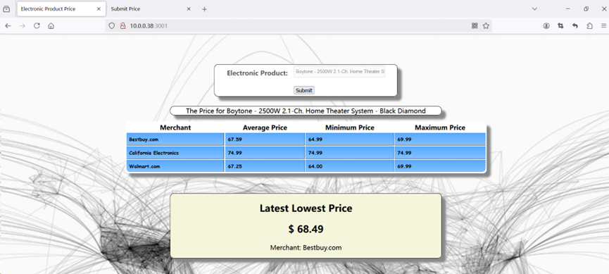

# Electronic Device Price Tracking Application

## Overview

This repository contains all scripts and source code for the **Electronic Device Price Tracking Application**. The application is designed to offer **price data analysis** for selected electronic devices across various merchants, as well as provide the **real-time lowest price**. This enables users to compare options and make informed purchasing decisions.



## Run the Application

The application can be launched by executing the commands below on the Azure cluster.

```
// start the webserver, include the main page and real-time data ingest page.
cd qileichen/priceApp
node app.js 3001 http://10.0.0.26:8090 $KAFKABROKERS

//run spark to load kafka data into hive table
cd qileichen/kafkaWeb
spark-submit --verbose \
  --conf "spark.executor.extraJavaOptions=-Dlog4j.configuration=file:///home/sshuser/ss.log4j.properties" \
  --conf "spark.driver.extraJavaOptions=-Dlog4j.configuration=file:///home/sshuser/ss.log4j.properties" \
  --class StreamPrice \
  uber-SpeedLayer-1.0-SNAPSHOT.jar \
  $KAFKABROKERS
```

The website can be accessed via the following links. Please ensure that a proxy is configured to view the site.

```
http://10.0.0.38:3001
http://10.0.0.38:3001/submit-price.html
```

## Design & Implementation Details

### Raw Data

The application utilizes the **Electronic Products and Pricing Data** from Kaggle, which contains over 15,000 electronic products with pricing details across 10 unique fields from Datafiniti's Product Database. The dataset includes attributes such as brand, category, merchant, name, source, and more. Since the application's primary focus is price analysis across different merchants, we mainly leverage the fields: `name`, `prices.merchant`, `prices.amountMin`, and `prices.amountMax`.

Please refer to the `raw_data` directory for an overview of the raw data.

### Batch Layer

The raw data is first downloaded to the cluster and ingested into **HDFS**. I utilized **OpenCSVSerde** to serialize the dataset without applying any transformations, adhering to the best practice of maintaining raw data in the data lake. However, rows missing critical fields like `prices.amountMin`, `prices.amountMax`, or `prices.merchant` were removed to ensure data quality, as these omissions often result from bad data or formatting issues. Since this project focuses on price and merchant information, retaining only valid records is essential.

To optimize storage, I converted the dataset into an **ORC table** in Hive, named `price_history_qileichen`. This format was chosen for its efficient compression and query performance. You can find the relevant script in the `batch-layer` directory.

### Serving Layer

From the ORC table, I created a Hive table to calculate the **maximum, minimum, and average prices** for different merchants. This batch view is written to **HBase** as a serving layer table named `price_hbase_qileichen`. The data is straightforward, and joins were not required to meet the application's requirements. The script for this step is located in the `serving-layer` directory.

For the serving layer's front end, I developed a web interface to query the HBase table and display price analysis for various merchants. The combination of the device name and merchant serves as the key in HBase. When querying, a `scan` operation retrieves all rows with keys starting with the device name. On the front end, keys are parsed back into device names and merchants, and the data is formatted for clear presentation. Detailed code for this process is available in the `app` directory.


### Speed Layer

The application supports **real-time updates** by displaying the **latest lowest price** for a product on the webpage. This is achieved by integrating real-time price submissions from merchants through a Kafka topic.

To simplify the process, a webpage (`submit-price.html`) allows to directly submit the latest lowest price and merchant information. This data is published to a Kafka topic named `price_qileichen`. The related code is in the `app` directory.


A Speed Layer program subscribes to the Kafka topic. When new data is submitted, it processes the information and updates an HBase table called `latest_price_hbase_qileichen`. The front end is modified to query this table and display the **latest lowest price and corresponding merchant** to users.


## Acknowledgement

I would like to express my sincere gratitude to my professor and TA for your guidance and support throughout the course. Your insights and feedback have been invaluable in deepening my understanding of Big Data Application world.
